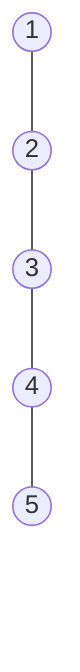

# Hello 2
## Test 2

Hello World! Test watcher!

$$
\frac{1}{2}
$$

$$
\texttt{asdf}
$$

$$
\begin{align*}
    a &= b \\
        &= c
\end{align*}
$$

---

```python
def test(x):
    return x ** 2
```

- test
- test

- [ ] test
- [ ] test


